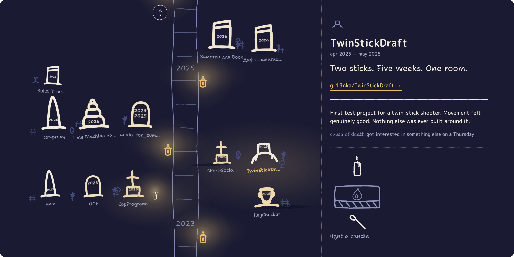
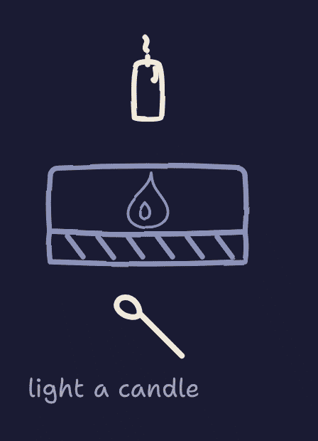
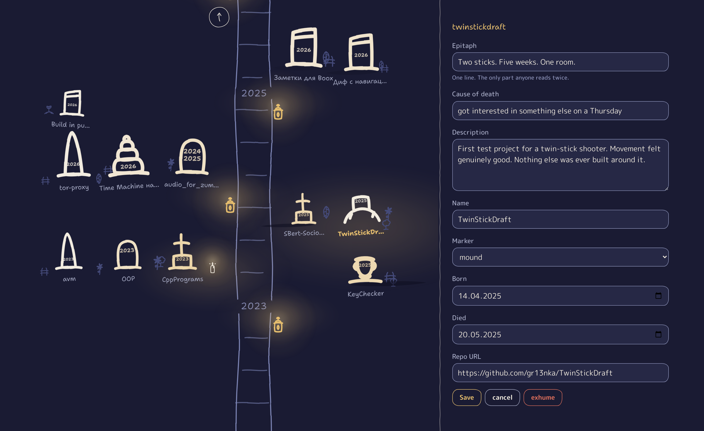

<div align="center">

# Graveyard

[](https://gr13nka.github.io/Graveyard/)
[](https://gr13nka.github.io/Graveyard/)
[](LICENSE)


***Your projects died. Bury them properly.***

<a href="https://gr13nka.github.io/Graveyard/"></a>

</div>

Everyone has the folder. Forty repos, last touched in 2023, that you'll absolutely get back
to. You won't. Graveyard gives each one a headstone — the years it lived, a one-line
epitaph, and how it died — then lets people light a candle over the remains.

No server, no database, no build step. A static page that commits to itself.

## Light a candle to show your honour



Read a grave to the end and there's a candle. Strike the match, mind your fingers. It keeps
burning when you come back, and it's yours alone — nobody's counting.
[How it works →](docs/GUIDE.md#lighting-a-candle)

## Quick start

Fork it and run it. Over http — as a `file://` URL the modules die quietly:

```bash
gh repo fork gr13nka/Graveyard --clone
cd Graveyard
echo '[]' > data/projects.json     # empty the yard — these graves are mine
python3 -m http.server 8000        # → http://localhost:8000
```

Bury your first project (below), then publish to Pages when it's worth showing.
[Fork & publish in full →](docs/GUIDE.md#making-your-own)

## Drive it with an agent

You have the repos; an agent has the patience. Open your fork in Claude Code — or anything
else — and paste this:

> Read CLAUDE.md first. Then run `node tools/bury.mjs --list` and show me my stalest repos.
> For each one I pick, run `node tools/bury.mjs <repo>` — take the description and the dates
> from GitHub, but leave the epitaph and the cause blank for me to write. When I have filled
> them in, commit and push.

`CLAUDE.md` holds the invariants an agent would otherwise break — chief among them that a
grave's position is a hash of its slug, so **renaming a slug moves the grave**.

## Bury a project

```bash
node tools/bury.mjs TwinStickDraft \
  --epitaph "Two sticks. Five weeks. One room." \
  --cause "got interested in something else on a Thursday"
```

One command, one grave. It fills in everything but the epitaph and the cause of death —
those are the only parts anyone reads, so they're yours to write.
[Every flag →](docs/GUIDE.md#burying-a-project)

## Bury an idea that was never built

```bash
node tools/autopsy.mjs ~/handoffs/handoff-kopia-backup.md --epitaph "..." --cause "..."
```

Some die before the first commit. They get a cairn instead of a headstone and a single
date: the day you admitted it wasn't happening.
[How an idea's grave differs →](docs/GUIDE.md#how-an-ideas-grave-differs)

## Edit from the page



`?edit` in the URL turns any grave into a form. Save commits straight to GitHub — still no
server, still nothing to run. [Setting it up →](docs/GUIDE.md#editing-from-the-page)

## FAQ

**Does it need a server?** No. It's a static page; the editor commits through a token you
paste once. The whole thing runs out of a folder.

**Where do the candles go?** Into the visitor's own browser and nowhere else. No count, no
leaderboard, nobody to impress — a grave has a candle for you, or it doesn't.

**What if it isn't really dead?** Then don't bury it. But the repo you haven't opened since
2023 is not "on hold," and you know it.

**Why would I want a graveyard?** Closure, mostly. It also reads better on your profile than
a list of repos that stopped.

## Docs

Every option, the data file format, the `?edit` token and how the lighting works are in
**[docs/GUIDE.md](docs/GUIDE.md)**. Invariants and traps for anyone changing the code are
in [CLAUDE.md](CLAUDE.md).

## License

MIT — dig one up, move it, make it your own. The drawing follows
[Karakuli](https://github.com/gr13nka/karakuli), used unmodified apart from
[two deliberate departures](docs/GUIDE.md#a-note-on-the-style).
